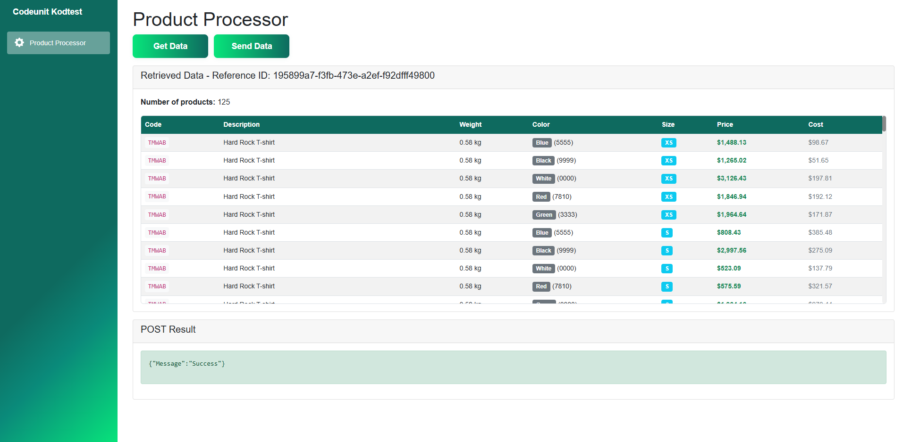

# Codeunit Code Test – Product Processor

A modern Blazor WebAssembly application for processing and visualizing product data from an external API.  
Demonstrates API integration, data mapping, error handling, and responsive UI/UX.

## Demo



## Features

- **API Integration**: Retrieves data from external APIs with basic authentication
- **Data Mapping**: Transforms data between different formats using a custom mapper
- **Real-time Processing**: Visualizes and processes product data in real-time
- **Responsive Design**: Modern UI with gradient styling and responsive tables
- **Error Handling**: Comprehensive error handling and user feedback

## Architecture

### Project Structure

```
KodtestCodeunit/
├── Models/                 # Data models
│   ├── GetDataModel.cs     # Incoming data structure
│   ├── GetDataResponse.cs  # API response wrapper
│   ├── ProductModel.cs     # Outgoing data structure
│   ├── Variant.cs          # Product variant model
│   └── PostModelRequest.cs # API request wrapper
├── Services/               # Business logic
│   └── ApiService.cs       # API communication service
├── Mappers/                # Data transformation
│   └── ProductMapper.cs    # Data mapping logic
├── Pages/                  # Blazor pages
│   ├── Index.razor         # Landing page with introduction
│   └── ProductProcessor.razor # Main application page
└── Layout/                 # UI layout components
    ├── MainLayout.razor    # Main layout
    └── NavMenu.razor       # Navigation menu
```

### Key Components

#### 1. **ApiService** (`Services/ApiService.cs`)

- Handles HTTP communication with external APIs
- Implements basic authentication
- Manages data retrieval and submission
- Provides error handling and response validation

#### 2. **ProductMapper** (`Mappers/ProductMapper.cs`)

- Transforms data between different formats
- Groups products by code and creates variants
- Implements SKU generation logic (ProductId-ColorId-Size)
- Follows Single Responsibility Principle

#### 3. **Data Models** (`Models/`)

- **GetDataModel**: Represents incoming product data
- **ProductModel**: Represents outgoing product data
- **Variant**: Represents product variants with SKU information
- **PostModelRequest**: Wraps data for API submission

## How It Works

### 1. Data Retrieval

1. User clicks "Get Data" button
2. `ApiService.GetDataAsync()` sends GET request with basic authentication
3. API returns product data in `GetDataModel` format
4. Data is displayed in a responsive table

### 2. Data Processing

1. `ProductMapper.MapToPostModel()` transforms the data:
   - Groups products by code
   - Creates variants for each product
   - Generates SKU using format: `ProductId-ColorId-Size`
   - Maps all required fields to new format

### 3. Data Submission

1. User clicks "Send Data" button
2. Mapped data is sent via POST request with basic authentication
3. API returns success confirmation
4. Result is displayed to user

## Technical Implementation

### Authentication

```csharp
// Basic authentication implementation
string credentials = "viggo:qwerty123";
string base64Credentials = Convert.ToBase64String(
    System.Text.Encoding.UTF8.GetBytes(credentials)
);
request.Headers.Authorization = new AuthenticationHeaderValue("Basic", base64Credentials);
```

### Data Mapping

```csharp
// SKU generation
Sku = $"{item.Code}-{item.ColorId}-{item.Size}"

// Product grouping
var groupedProducts = getDataResponse.Products
    .GroupBy(p => p.Code)
    .ToList();
```

### Error Handling

- **Try-catch blocks** for network operations
- **User-friendly error messages**
- **Loading states** with spinners
- **Graceful degradation** on failures

## Getting Started

### Prerequisites

- .NET 8.0 SDK
- Modern web browser
- Internet connection (for API access)

### Running the Application

1. Clone the repository
2. Navigate to the project directory
3. Run the application:
   ```bash
   dotnet run
   ```
4. Open browser and navigate to `https://localhost:5001`

### Usage

1. **Get Data**: Click "Get Data" to retrieve product information
2. **View Data**: Browse the responsive table with product details
3. **Send Data**: Click "Send Data" to process and submit the data
4. **View Results**: Check the success message and processed data

**Built with Blazor WebAssembly and .NET 8**

## Author

Viggo Sjöström
